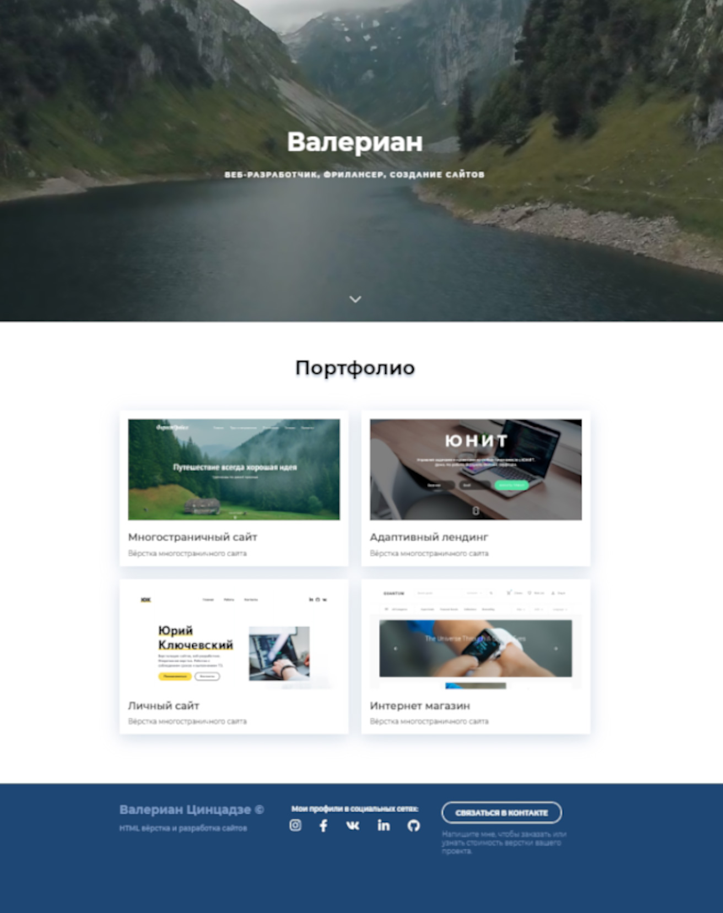

# Сайт-портфолио

## О проекте:

Простенький сайт-портфолио HTML верстальщика сайтов. Данный проект я сверстал за время прохождения онлайн-курсов по верстке сайтов от [Webcademy.ru](https://webcademy.ru/).

* Срок выполнения: 1 день
* Количество страниц: 2
* Демо онлайн: [portfolio-by-valerian.netlify.app](https://portfolio-by-valerian.netlify.app/index.html)
* Код на Github: [github.com/Anatoluch/portfolio-simple-site](https://github.com/Anatoluch/portfolio-simple-site)
## Технологии:
Адаптивная верстка, HTML5, CSS3, JavaScript, jQuery.
## Особенности:

Адаптивная верстка, кроссбраузерность, фоновое видео в шапке с помощью плагина Vide.
___
_Если Вам нужен специалист по верстке сайтов - обращайтесь! Я с удовольствием помогу!_
